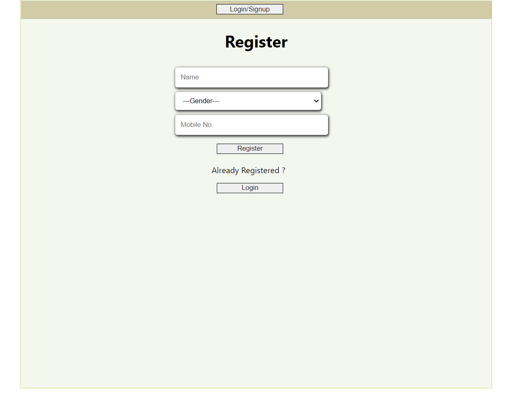
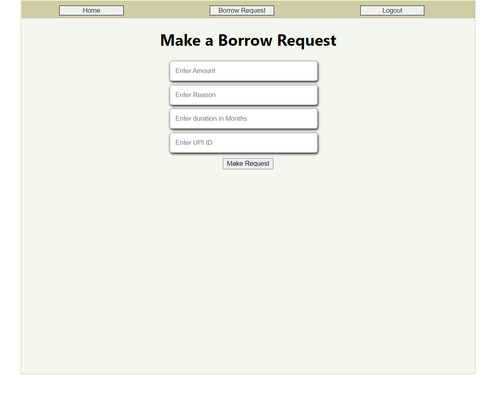
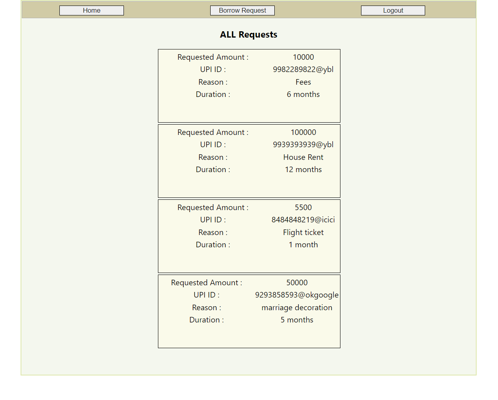

This project requires the following software to be intstalled on your system

NodeJS / NPM - https://nodejs.org/en/
Git - https://git-scm.com/downloads
Getting a copy of this starter
You can simply fork this folder to start working on it.

To push your changes to Github/Gitlab you need to create a new repository and push the changes there.

## Setup instructions for Backend 

Open a teminal and move into the server directory
then run the following command

```
backend
    src
        index.js -> handles all backend requests 
```

Edit the variables in `.env` file you just created.
The secret key can be any random string.
The rest are specific to you.


## Opening development server

```
srver -> run npm init to start dev server for backend

client -> npx create-react-app to start a frontend
```

This will start a development server at [localhost:3001](localhost:3001) for backend


## Database management

This repo used MongoDB Atlas.
To connect you backend to database( 
https://www.mongodb.com/ )  update .env file by your backend url

write following code in index.js

```
mongoose
  .connect(process.env.MONGODB_URL)
  .then(() => {
    console.log("DB is connected .......");
  })
  .catch((err) => {
    console.log(err);
  });
  ```


## Setup instructions for Frontend

Move into the frontend directory and first install the node modules by running

### `npm install`

In the project directory, you can run:

### `npm start`

Runs the app in the development mode.\
Open [http://localhost:3000](http://localhost:3000) to view it in the browser.

The page will reload if you make edits.\
You will also see any lint errors in the console.


## Setup instructions for the Server

Since the app is built into two separate Frontend and Backend modules,
it is required to be hosted from a single server name.
Otherwise, problems regarding CORS will hinder Authentication services.

We use express to serve the frontend and the backend on the same server name.

```
const express = require("express");
const cors = require("cors");
const app = express();
app.use(cors());

```

# Approach 

```
 There are 4 screens in the web app and a Navigation bar.
 1. Signup Screen 
    there are 3 user details requered for sing up 
    a) Name
    b) Gender
    c) Mobile no.
    An OTP verification performed using fast2sms sms service provider.
    Once verification done successfully user details are stored in MongoDB database.
 2. Login Screen
    Already registered user can login after performing OTP verification using mobile number.
 3. Borrow Request Screen
    This screen allow users to make request from friends.
    there are 4 field required to make request
    a) requested amount
    b) reason for request
    c) duration of borrowing
    d) UPI ID
 4. All Requests
    This screen show all the request made by user.
```

# Technologies used

```
  React Hooks :- useState, useEffect, useContext
  Axios :- HTTP client based service to fetch APIs
  Express :- Backend Web application framework for node.js
  Mongoose :- Object Data Modeling library for MongoDB
  fast2sms :- online sms service provider that is used for OTP verification
```


# PREVIEW

Following are some of the features of the application

## Registration page



## Borrow Request page



## All Requests made




